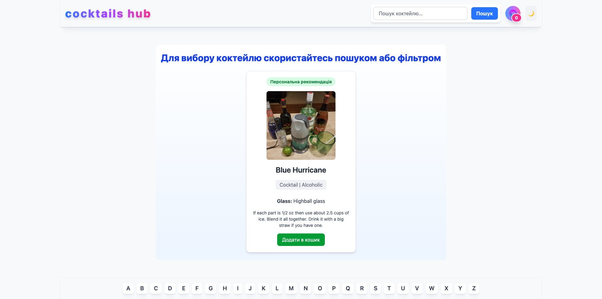
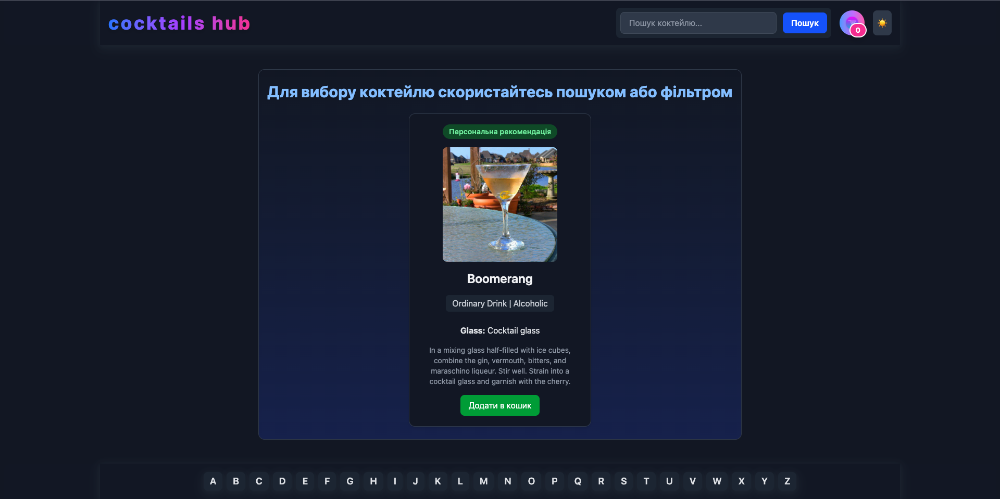
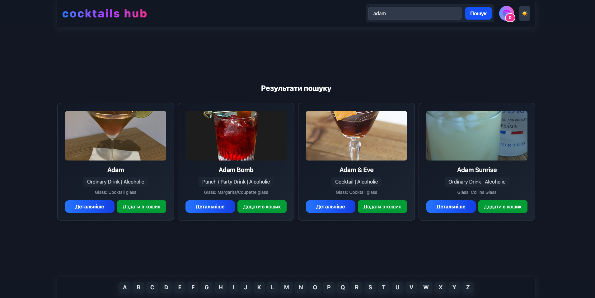
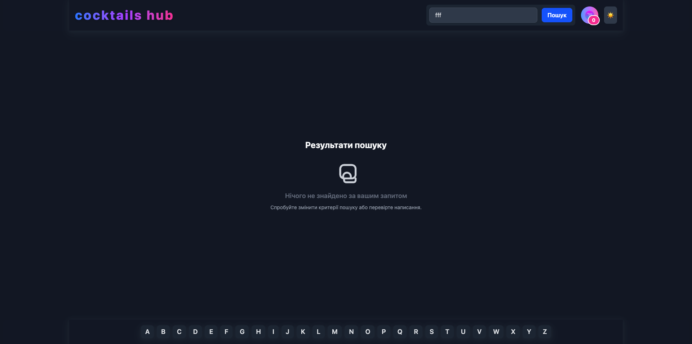
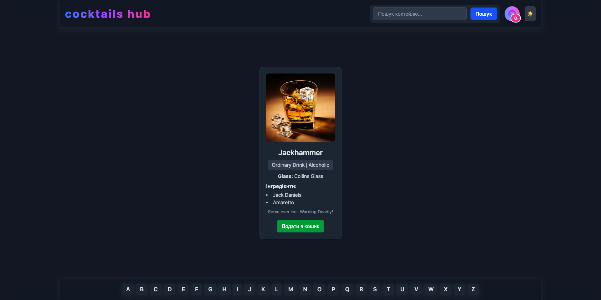
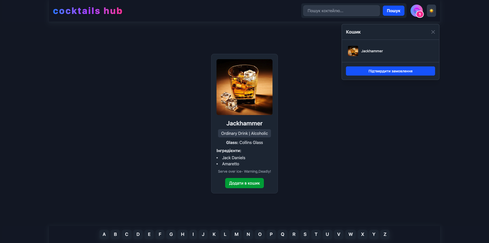
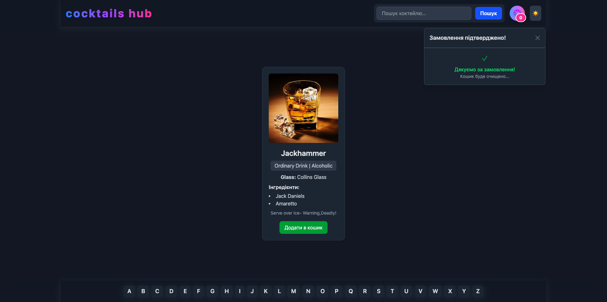

# 🍸 CocktailsHub 🍹

CocktailsHub is a modern web application for searching, viewing, and ordering cocktails. It features a fast, responsive UI and adaptive design for mobile and desktop devices.

## 🛠️ Technologies Used

- ⚛️ [React](https://react.dev/) (with hooks and context)
- 🟦 [TypeScript](https://www.typescriptlang.org/)
- 🎨 [TailwindCSS](https://tailwindcss.com/)
- ⚡ [Vite](https://vitejs.dev/)
- 🌐 [Axios](https://axios-http.com/)
- 🛣️ [React Router](https://reactrouter.com/)
- 🧩 [ESLint](https://eslint.org/) & [Prettier](https://prettier.io/)
- 🍹 [TheCocktailDB API](https://www.thecocktaildb.com/)

## ✨ Features

- 🔍 Search cocktails by name or by letter
- 📄 View detailed cocktail information
- 🛒 Add cocktails to basket and place orders
- 📱 Responsive layout and adaptive UI
- 🌗 Light/dark theme toggle
- ⚡ Error and loading states for better UX
- 💾 Input value persistence (localStorage)

## 🖼️ Visual Overview

### White Theme

# 🌍 Demo

### Home Page

### Search Page

### Cocktail Details

### Basket/Order Modal

### Light Theme

🌐 Try it online: [CocktailsHub](https://cocktailshub.vercel.app)
